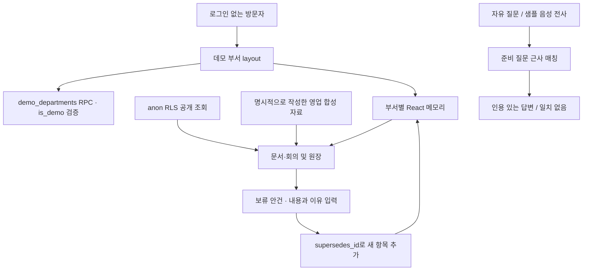

# 공개 데모 데이터 흐름

아래는 파일 참조를 확인해 작성한 수동 구조도이며 Archify 실행 결과가 아니다.

```mermaid
flowchart TD
  Guest[로그인 없는 방문자] --> Layout[데모 부서 layout]
  Layout --> Check[demo_departments RPC · is_demo 검증]
  Layout --> State[부서별 React 메모리]
  Read[anon RLS 공개 조회] --> Documents[문서·회의 및 원장]
  Synthetic[명시적으로 작성한 영업 합성 자료] --> Documents
  Documents --> Deferred[보류 안건 · 내용과 이유 입력]
  Deferred --> Append[supersedes_id로 새 항목 추가]
  Append --> State
  State --> Documents
  Question[자유 질문 / 샘플 음성 전사] --> Match[준비 질문 근사 매칭]
  Match --> Evidence[인용 있는 답변 / 일치 없음]
```

DB/LLM 쓰기 경로가 없으며 실제 서비스 API는 사용하지 않는다. 메모리 변경은 동일 부서의 클라이언트 이동에서 유지되고 새로고침하면 사라진다.
